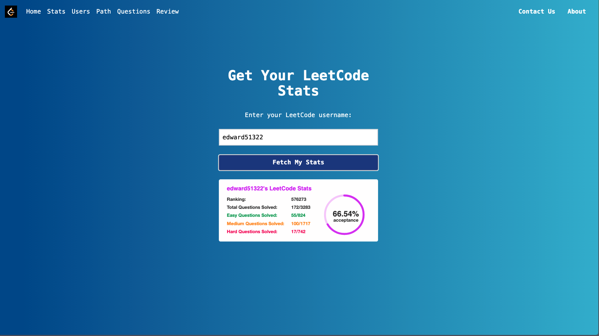

# LeetCode Stats API Application

## Getting Started

To run the application locally, follow the steps below:

### Frontend Setup

1. Navigate to the frontend directory:

    ```bash
    cd frontend
    ```

2. Install the required dependencies:

    ```bash
    npm install
    ```

3. Start the frontend server:

    ```bash
    npm start
    ```

### Backend Setup

1. Navigate to the backend virtual environment:

    ```bash
    cd backend/flask/.venv
    ```

2. Make sure to configure your database connection. Update `db_connect.py` in the backend directory to connect to your own database.

3. Run the backend server:

    ```bash
    flask run
    ```

**Important Notes:** It is not recommended to directly use the backend code. A better way to do so is to create your own virtual environment in python and modify code in .venv

### Database Configuration

To properly launch the backend, you must modify the `db_connect.py` file located in `backend/flask/.venv/`. Ensure it points to your own database connection details, including host, username, password, and database name.

## Development

For development, ensure that both the frontend and backend are running simultaneously. This will allow you to see real-time updates and test the full functionality of the application.

- **Frontend**: [http://localhost:3000](http://localhost:3000)
- **Backend**: [http://localhost:5000](http://localhost:5000)

Happy coding!

The LeetCode Stats API Application is designed to help users efficiently track their progress on LeetCode by fetching real-world statistics based on their usernames. Users can view detailed stats including total problems solved, as well as breakdowns by difficulty (easy, medium, and hard). The application also offers a recommended question path tailored to enhance the user's coding proficiency and preparation for technical interviews.

Additionally, users have the ability to import their data into our proprietary database. This feature allows users to create, update, and delete their personalized review questions, making it a comprehensive tool for managing their LeetCode journey.

## Features

- **User Stats**: Fetch and display user stats from LeetCode, including total problems solved and categorization by difficulty.
- **Recommended Paths**: Suggests an efficient sequence of problems to solve, helping users to improve steadily.
- **Personalized Data Management**: Users can manage their data by adding personalized notes and reviews to the questions they solve.
  
## Technology Stack

- **Frontend**: React and Tailwind CSS
- **Backend**: Flask
- **Database**: Custom database schema designed for user data and reviews.

## Example



## Credits

We use an external API, <https://github.com/JeremyTsaii/leetcode-stats-api.git>, to fetch real-time statistics from LeetCode based on the provided username. This allows our application to provide up-to-date information and a dynamic user experience.

## Backend API

Our backend API complements the external LeetCode data by providing personalized recommendations and managing user-specific data like problem reviews and notes. It handles all interactions with our own database, ensuring data consistency and security.

## Database

Our custom database is designed to store user profiles, their problem-solving stats, personalized reviews, and our recommended question paths. This allows for a robust, scalable way to keep user data organized and accessible
