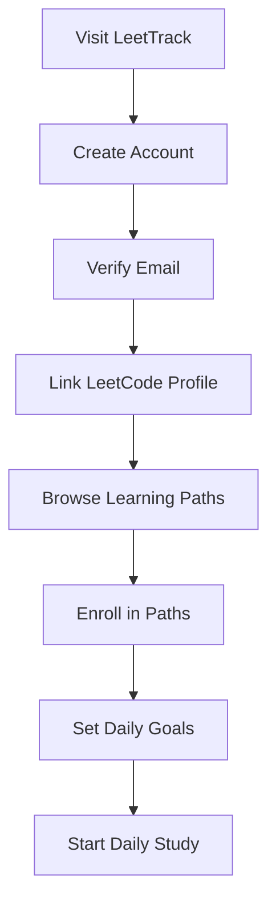
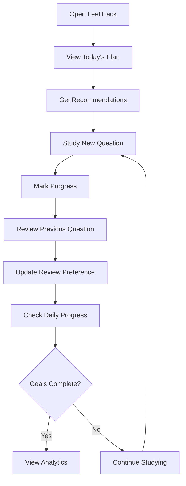
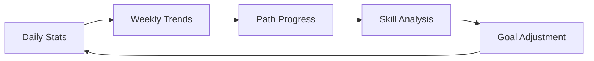
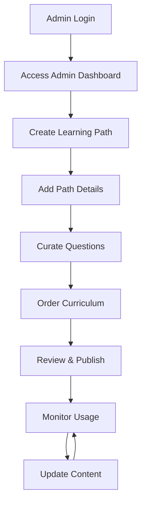
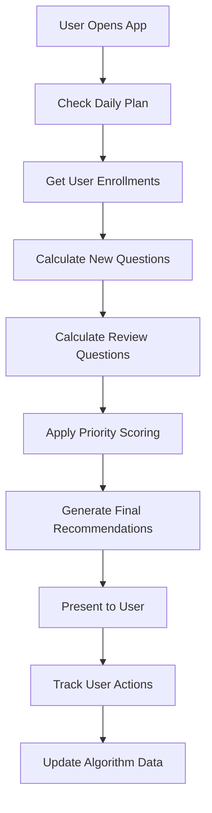
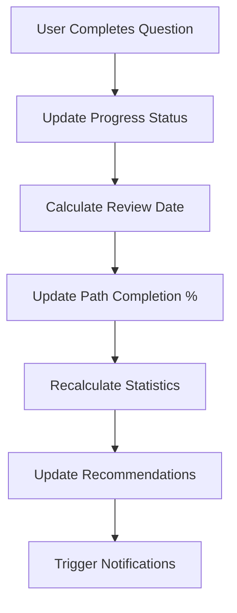

# LeetTrack User Workflows & Admin Guide

## 👥 User Personas and Workflows

### 🎓 Student User Journey

#### 1. Onboarding Process


**Step-by-Step Process:**
1. **Registration**
   - Fill registration form (email, username, password)
   - Optional: Link LeetCode username for progress sync
   - Verify email address

2. **Path Discovery**
   - Browse available learning paths by difficulty
   - View path details (description, duration, question count)
   - Read curriculum overview

3. **Enrollment**
   - Enroll in one or multiple paths simultaneously
   - Set learning priorities if multiple paths selected

4. **Daily Planning**
   - Set daily study goals (e.g., "3 new problems, 2 reviews")
   - Choose study time preferences
   - Configure notification settings

#### 2. Daily Study Workflow


**Daily Activities:**
1. **Morning Planning**
   - Review today's study plan
   - Adjust goals if needed
   - Check recommended questions

2. **Study Session**
   - Work through "new" questions from enrolled paths
   - Practice "review" questions from previous sessions
   - Mark completion and difficulty rating

3. **Progress Tracking**
   - Update question status (completed/needs review)
   - Set review preferences for future sessions
   - Add personal notes

4. **Evening Review**
   - Check daily goal completion
   - Review progress analytics
   - Plan tomorrow's session

#### 3. Progress Monitoring


**Analytics Features:**
- **Daily Dashboard**: Today's progress, streak count, goals met
- **Progress Timeline**: Visual progress across all enrolled paths
- **Performance Insights**: Difficulty distribution, topic strengths/weaknesses
- **Study Patterns**: Best performing times, consistency tracking

---

### 🔧 Admin User Journey

#### 1. Content Management Workflow


#### 2. Learning Path Creation Process

**Phase 1: Path Planning**
1. **Define Learning Objectives**
   - Identify target skill level (Beginner/Intermediate/Advanced)
   - Set learning outcomes and goals
   - Estimate completion timeframe

2. **Content Strategy**
   - Choose topic focus (Arrays, Graphs, Dynamic Programming, etc.)
   - Determine progression difficulty curve
   - Plan question variety and coverage

**Phase 2: Path Building**
1. **Basic Path Setup**
   ```
   POST /api/admin/paths
   {
     "title": "Master Array Algorithms",
     "description": "Comprehensive array manipulation and optimization techniques",
     "difficulty_level": "Intermediate",
     "estimated_duration_days": 21
   }
   ```

2. **Question Curation**
   - Search existing questions by topic and difficulty
   - Import questions from LeetCode GraphQL API
   - Create custom practice problems if needed
   - Order questions by learning progression

3. **Curriculum Organization**
   ```
   POST /api/admin/paths/{path_id}/questions
   {
     "questions": [
       { "question_id": "q1", "order_index": 1, "is_required": true },
       { "question_id": "q2", "order_index": 2, "is_required": true },
       { "question_id": "q3", "order_index": 3, "is_required": false }
     ]
   }
   ```

**Phase 3: Quality Assurance**
1. **Content Review**
   - Verify question quality and relevance
   - Check difficulty progression
   - Ensure comprehensive coverage

2. **Testing & Validation**
   - Test complete user journey through path
   - Validate recommendation algorithm performance
   - Check progress tracking accuracy

#### 3. Admin Dashboard Interface Design

**Main Dashboard Sections:**

1. **Overview Panel**
   ```
   📊 Platform Statistics
   - Total Users: 1,247
   - Active Paths: 12
   - Questions Solved Today: 3,421
   - Average Daily Engagement: 67%
   ```

2. **Path Management**
   ```
   📚 Learning Paths
   ┌─────────────────────────────────────────┐
   │ Array Fundamentals    [Edit] [Stats]    │
   │ ├ 45 questions                          │
   │ ├ 234 enrolled users                    │
   │ └ 87% avg completion                    │
   ├─────────────────────────────────────────┤
   │ Graph Algorithms      [Edit] [Stats]    │
   │ ├ 67 questions                          │
   │ ├ 156 enrolled users                    │
   │ └ 72% avg completion                    │
   └─────────────────────────────────────────┘
   ```

3. **Question Library**
   ```
   🔍 Question Management
   ┌─────────────────────────────────────────┐
   │ [Search] [Filter] [Add New]             │
   ├─────────────────────────────────────────┤
   │ Two Sum              Easy    [Edit]     │
   │ Add Two Numbers      Medium  [Edit]     │
   │ Longest Substring... Medium  [Edit]     │
   └─────────────────────────────────────────┘
   ```

4. **User Analytics**
   ```
   👥 User Insights
   - Top Performing Paths
   - Engagement Metrics
   - Completion Rates
   - User Feedback
   ```

---

## 🎯 Key User Scenarios

### Scenario 1: New Graduate Preparing for Interviews
**User Profile:** Recent CS graduate, 3 months until job search
**Goals:** Master fundamental algorithms, build consistency

**Workflow:**
1. **Week 1-2**: Enroll in "Array Fundamentals" and "Hash Table Mastery"
2. **Daily Routine**: 2 new problems + 1 review, 1-2 hours study time
3. **Progress Tracking**: Focus on completion speed and accuracy
4. **Week 3-4**: Add "Dynamic Programming Basics" path
5. **Month 2-3**: Advanced paths based on weak areas identified

### Scenario 2: Working Developer Upskilling
**User Profile:** 2 years experience, preparing for senior role
**Goals:** Advanced algorithms, maintain consistency with limited time

**Workflow:**
1. **Path Selection**: "Advanced Algorithms", "System Design Prep"
2. **Daily Routine**: 1 challenging problem daily, 30-45 minutes
3. **Review Strategy**: Heavy focus on spaced repetition
4. **Weekend Deep Dives**: Complex problems requiring more time

### Scenario 3: Bootcamp Graduate Skill Building
**User Profile:** Bootcamp graduate, strong web dev skills, weak algorithms
**Goals:** Build algorithmic thinking from scratch

**Workflow:**
1. **Foundation Building**: Start with "Programming Fundamentals"
2. **Progressive Difficulty**: "Easy Problems Mastery" → "Two Pointers" → "Recursion"
3. **High Volume Practice**: 3-4 problems daily with focus on patterns
4. **Frequent Reviews**: Review every 2-3 days to reinforce learning

---

## 👨‍💼 Admin Best Practices

### Content Curation Guidelines

#### 1. Learning Path Design Principles
- **Progressive Difficulty**: Start with foundational concepts, gradually increase complexity
- **Skill Building**: Each question should build upon previous knowledge
- **Practical Application**: Include real-world problem variations
- **Diverse Examples**: Cover different problem patterns within the topic

#### 2. Question Selection Criteria
```
✅ High-Quality Questions Should:
- Have clear, unambiguous problem statements
- Include multiple solution approaches
- Represent common interview patterns
- Have good test case coverage
- Be appropriate for target difficulty level

❌ Avoid Questions That:
- Are poorly written or confusing
- Have controversial or debated solutions
- Are too niche or specialized
- Lack proper test cases
- Have inconsistent difficulty ratings
```

#### 3. Curriculum Organization
```
📚 Recommended Path Structure:
1. Foundation (20-30% of questions)
   - Basic concepts and patterns
   - Easy to medium difficulty
   - High success rate expected

2. Core Practice (50-60% of questions)
   - Main topic algorithms
   - Medium difficulty focus
   - Variety of problem types

3. Advanced Applications (10-20% of questions)
   - Complex variations
   - Hard difficulty
   - Interview-level challenges

4. Integration (10% of questions)
   - Combines multiple concepts
   - Mixed difficulty
   - Real-world applications
```

### Analytics and Optimization

#### 1. Path Performance Monitoring
```
📊 Key Metrics to Track:
- Enrollment Rate: How many users choose this path?
- Completion Rate: What percentage finish the path?
- Drop-off Points: Where do users typically stop?
- Time to Complete: How long does it take on average?
- User Satisfaction: Feedback and ratings
- Skill Improvement: Before/after performance metrics
```

#### 2. Content Optimization Strategies
- **A/B Testing**: Test different question orders or explanations
- **Feedback Integration**: Regular review of user comments and suggestions
- **Performance Analysis**: Identify questions with low success rates
- **Content Updates**: Keep problems current with industry trends

#### 3. User Support and Engagement
```
🎯 Admin Responsibilities:
- Monitor user progress and identify struggling learners
- Respond to content feedback and questions
- Update paths based on user performance data
- Create supplementary materials for difficult concepts
- Maintain community guidelines and standards
```

---

## 🔄 System Workflows

### Recommendation Algorithm Workflow


### Progress Tracking Workflow


### Review Scheduling Algorithm
```python
def calculate_next_review_date(completion_date, review_count, difficulty_rating):
    """
    Spaced repetition algorithm for review scheduling
    """
    base_intervals = [1, 3, 7, 14, 30, 90]  # days

    # Adjust interval based on user's difficulty rating
    difficulty_multiplier = {
        1: 1.5,    # Easy - longer intervals
        2: 1.2,
        3: 1.0,    # Normal
        4: 0.8,
        5: 0.6     # Hard - shorter intervals
    }

    interval_index = min(review_count, len(base_intervals) - 1)
    base_interval = base_intervals[interval_index]

    multiplier = difficulty_multiplier.get(difficulty_rating, 1.0)
    final_interval = int(base_interval * multiplier)

    return completion_date + timedelta(days=final_interval)
```

---

This comprehensive workflow documentation provides clear guidance for both users and administrators to effectively use and manage the LeetTrack platform.